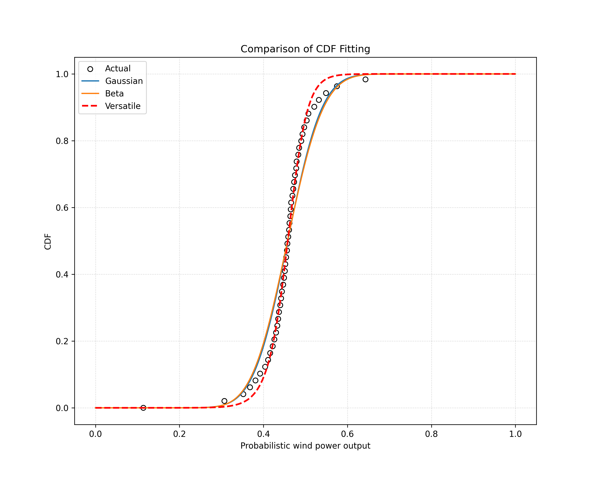

# 电力系统可靠性课程作业1: 通用分布函数拟合

2026年3月3日

Z. -S. Zhang, Y. -Z. Sun, J. Lin, L. Cheng and G. -J. Li, "Versatile distribution of wind power output for a given forecast value," 2012 IEEE Power and Energy Society General Meeting, San Diego, CA, USA, 2012, pp. 1-7, doi: 10.1109/PESGM.2012.6344672.

这篇论文由清华大学Zhao-Sui Zhang等学者撰写，提出了一种能够灵活模拟风电出力不确定性的**Versatile（通用型）分布模型**。本次作业针对这篇论文的核心部分进行复现。

请参考以下由AI生成的论文详细分析和复现方法建议：

------

## 一、 论文核心摘要：问题与解决方案

### 1. 主要问题

- **传统模型局限性**：常用的高斯（Gaussian）、Beta 和柯西（Cauchy）分布在所有场景下难以完美拟合风电误差。例如，高斯和柯西分布在预测值接近 0 或装机容量时，无法体现非对称性。
- **CDF 形式缺失**：系统调度更关注累积分布函数（CDF）或分位数函数，但传统模型的 CDF 通常没有解析形式（Closed form），依赖数值积分，这会产生累积误差并降低计算效率。
- **参数固定**：传统分布的形状参数往往由均值和方差固定，无法适应不同预测周期或空间分布下的形状变化。

### 2. 解决方案

论文提出了一种**Versatile 分布模型**，其核心特征如下：

- **显式数学表达式**：其 PDF 和 CDF 均有解析形式，且 CDF 的反函数（用于计算置信区间）也可以直接写出。

- **数学公式**：

  $$PDF(x|a,b,c)=\frac{abe^{-a(x-c)}}{(1+e^{-a(x-c)})^{b+1}}$$

  $$CDF(x|a,b,c)=(1+e^{-a(x-c)})^{-b}$$

  $$CDF^{-1}(y|a,b,c)=c-\frac{1}{a}\ln(y^{-\frac{1}{b}}-1)$$

- **高适配性**：通过调整形状参数 $a, b, c$，该分布可以变形以模拟各种实际的风电误差形状，结合了高斯、Beta 和柯西分布的优点.

------

## 二、 算例实现具体步骤

要实现论文中的图表（如 Fig. 1-6）和 Table II 的结果，建议按以下步骤操作：

### 1. 数据准备与预处理

- **数据需求**：你需要同一风电场的**历史预测功率**和**实际出力功率**时间序列数据。

- **标准化**：将功率数据除以装机容量，转换至 $[0, 1]$ 标幺值（p.u.）系统。

- **预测方法（备选）**：若无预测数据，论文使用了**持续预测法（Persistence method）**, 即$\hat{P}(t+k|t) = \frac{1}{T} \sum_{i=0}^{n-1} P(t - i\Delta t)$.

### 2. 数据分桶（Binning）

这是处理不确定性的关键步骤：

- **分桶逻辑**：将所有预测值按大小排序，划分为 $N_f=25$ 个桶（Bin），每个桶的宽度为 $0.04$ p.u.
- **样本归类**：将每个时刻对应的“实际出力值”归入其预测值所属的桶中 。例如，所有预测值在 $[0.48, 0.52]$ 之间的时刻，其对应的实际功率样本构成“第 13 号桶”的数据集。

### 3. 生成“实际分布”曲线

- **实际 PDF**：对每个桶内的实际功率样本绘制概率密度直方图。
- **实际 CDF**：对直方图进行离散积分，得到经验分布曲线。

### 4. 参数拟合（核心环节）

你需要利用非线性最小二乘法（如 Python 中的 `scipy.optimize.curve_fit`）对每个桶的数据进行拟合。

- **拟合目标**：直接使用论文给出的 CDF 公式 $CDF(x|a,b,c)=(1+e^{-a(x-c)})^{-b}$ 来拟合该桶的实际 CDF 曲线。
- **参数参考值**：拟合时可参考论文 Table I 提供的数值作为初始搜索点。例如，对于中间功率区间（Bin 13），参数大约在 $a \approx 14.9$, $b \approx 1.28$, $c \approx 0.43$.
- **对比组设置**：同时计算高斯、Beta 和柯西分布的参数，以便进行后续对比。

### 5. 验证与分析

- **RMSE 计算**：使用论文公式 (3) 计算拟合 CDF 与实际 CDF 之间的均方根误差.
- **置信区间推导**（略）利用反函数公式 (5) 和 (6) 计算特定置信水平（如 90%）下的上下限，并与实际统计的百分位数进行对比 .

------

## 三、 作业要求与提示：复现时的注意事项

- **风电预测数据Pw_forecast.csv**：来自某415MW风电场2024年10月-2025年11月的数据，已标幺化处理。

- **计算高斯分布, Beta分布, 通用分布函数的拟合参数**：分别为$(\mu,\sigma)$, $(a,b)$, $(a,b,c)$.

- **给出高斯分布, Beta分布, 通用分布函数的拟合精度RMSE**：可以采用论文公式(3)并设置$N_{o}=100$.

- **适当的图形化拟合结果**，例如[0.44,0.48]的曲线拟合结果如下图所示：

- **CDF 拟合优于 PDF**：论文强调直接拟合 CDF 能够避免 PDF 数值积分带来的误差 。在代码实现时，请务必以 CDF 曲线作为拟合目标。

- **代码工具** ： `Python`代码可以使用`scipy`中的`norm.fit`,`beta.fit`,`curve_fit`来简单实现，使用`matplotlib`绘图。